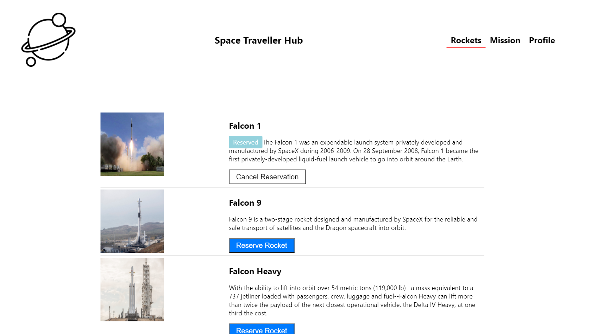

# Space Traveller's Hub

> In this project we created a single page application using react-redux

On this website you can join missions and reserve rockets

## Built With

- React and Redux
- Redux-thunk, Redux-logger, axios.
- Javascript

## Getting Started

To get a local copy up and running follow these simple example steps.

## Prerequisites
- A working Laptop or Desktop
## Setup
- Install code editor
- Install Git bash
- Create react app
- Install react-redux

## Install

clone [Bookstore](https://github.com/Emmy-github-webdev/space-traveller)

## Usage
- Test your GitHub flow, a linter and professional documentation ability
## Run tests
- Run npm start to run the project

## Dependencies

- redux 
- react-redux 
- redux-thunk 
- redux-devtools-extension
- react-router-dom

# Authors
👤 **Emmanuel Oga**
- GitHub: [Emmy-github-webdev](https://github.com/Emmy-github-webdev)
- Twitter: [@ogaemmanuel](https://twitter.com/OgaemmanuelOga).
- LinkedIn: [@ogaemmanuel](https://www.linkedin.com/in/emmanuel-oga-16171584/)

👤 **Anibal Amoroso**
- GitHub: [sj1978](https://github.com/sj1978)
- Twitter: [@AmorosoAnibal](https://twitter.com/AmorosoAnibal).
- LinkedIn: [Anibal Amoroso](linkedin.com/in/anibalamoroso)

## 🤝 Contributing

Contributions, issues, and feature requests are welcome!
Feel free to check the [issues page](https://github.com/Emmy-github-webdev/space-traveller/issues).

## Show your support

Give a ⭐ if you like this project!

## Acknowledgments

- Hat tip to anyone whose code was used
- Inspiration
- etc

## 📝 License

This project is [MIT](./MIT.md) licensed.

